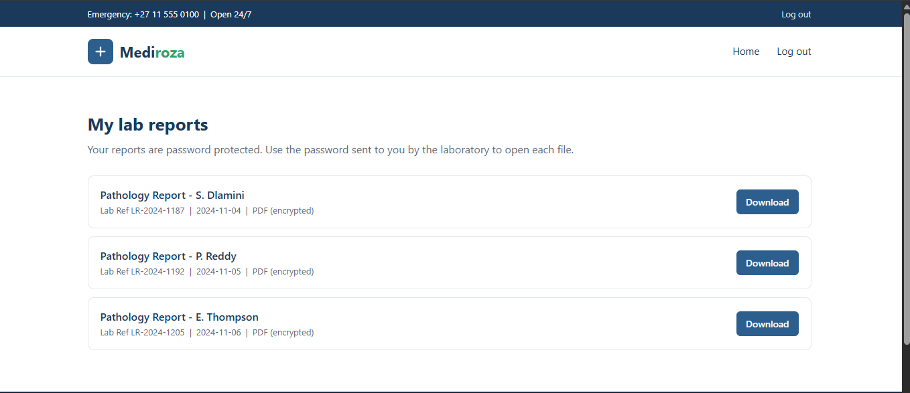
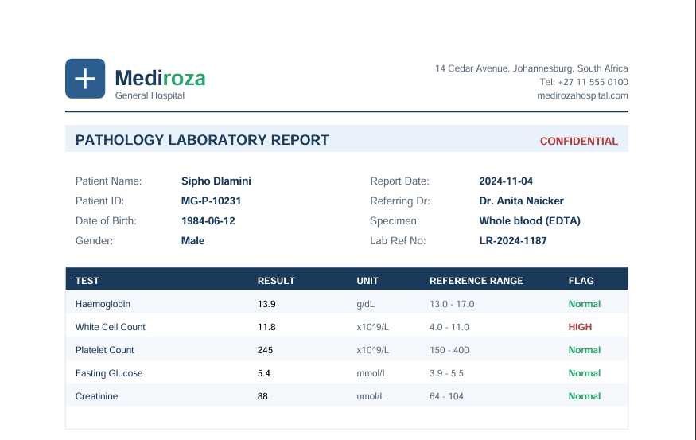
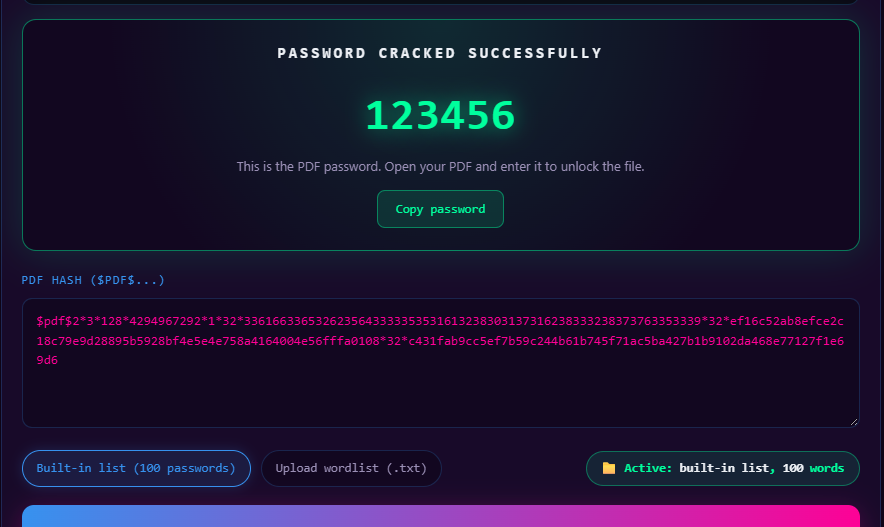
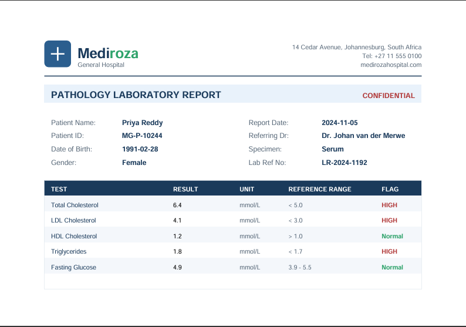
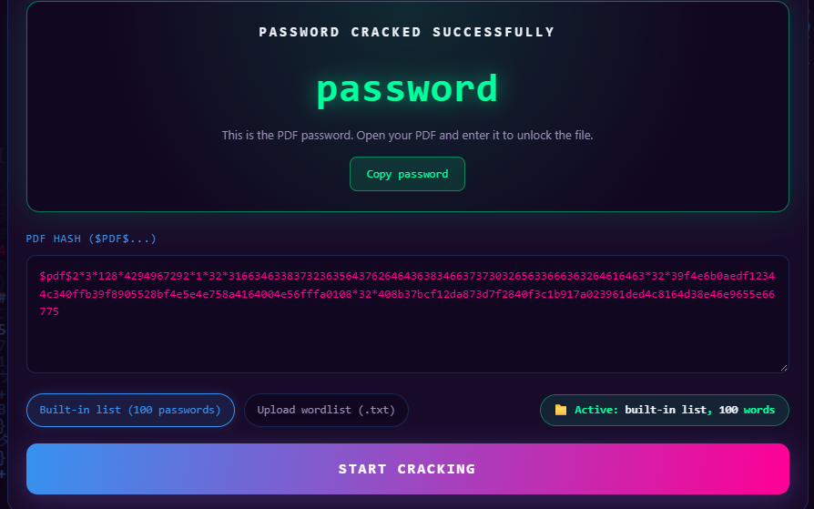
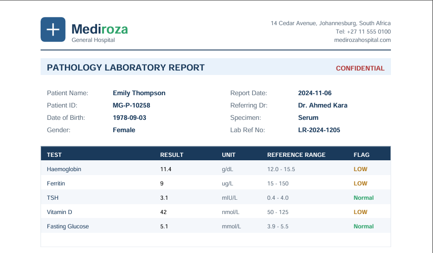
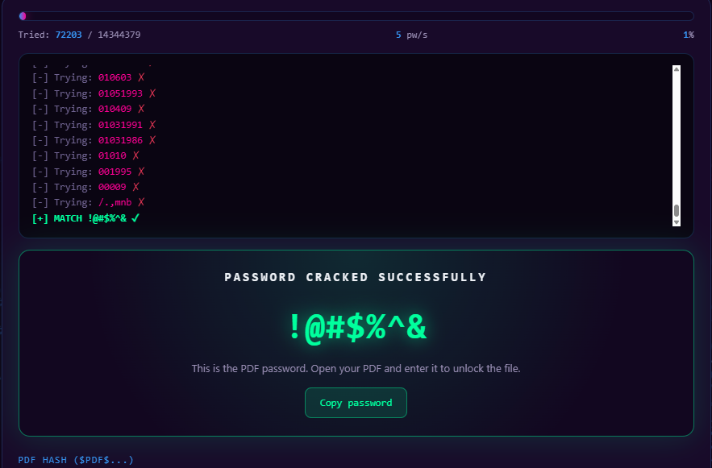
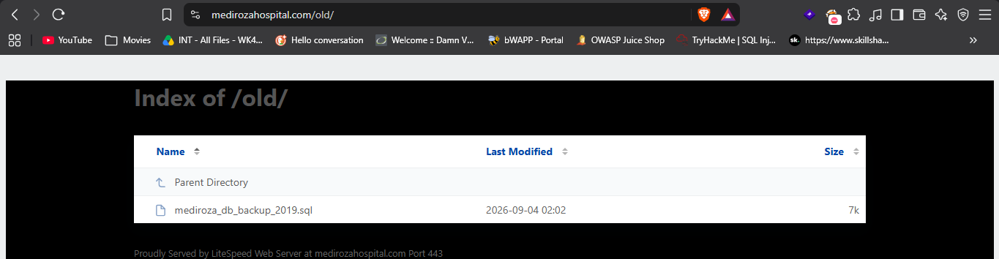
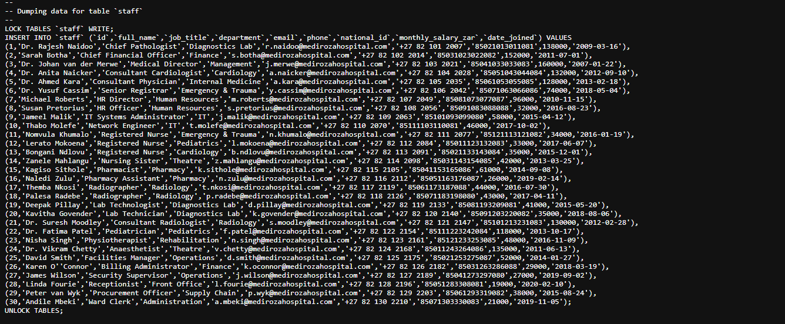
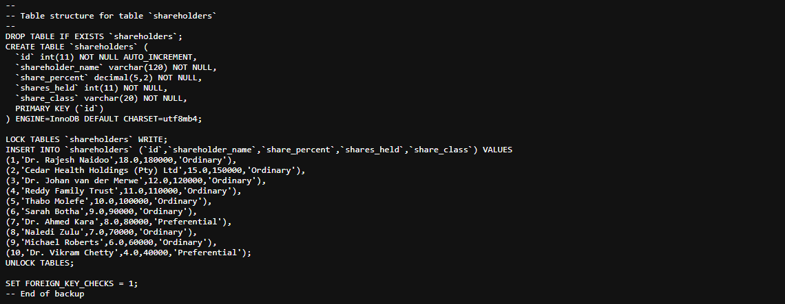

# Mediroza General Hospital — Penetration Testing Report

**NetworkWalks | Batch B083 | Week 4**  
**Project:** Penetration Testing & Vulnerability Assessment  
**Target:** `https://medirozahospital.com`  
**Assessment Type:** Black-box web penetration test  
**Duration:** 5 days  
**Authorization:** Written permission granted in the NetworkWalks project brief  
**Prepared by:** Narendra Singh Mahara  
**Report Date:** 30 September 2026

> **Confidentiality:** This report contains security-testing evidence and references confidential patient, employee, and shareholder information discovered during an authorized training engagement. Keep the report and evidence set within the authorized project environment.

---

## 1. Executive Summary

### 1.1 Engagement Overview

The assessment was performed against **Mediroza General Hospital** as part of the NetworkWalks Batch B083 Week 4 penetration-testing project.

The NetworkWalks brief defines four milestones:

1. **M1 — Initial Access:** retrieve three confidential patient PDF laboratory reports.
2. **M2 — Data Extraction:** recover the encryption passwords for all three files.
3. **M3 — Critical Data Exposure:** identify staff salaries and shareholder details.
4. **M4 — Pentest Report:** document the engagement, evidence, risk, and remediation.

The project scope was a full black-box test of the target domain. The brief explicitly excluded social engineering, denial-of-service testing, and testing outside the agreed target.

### 1.2 Key Findings

| ID | Finding | Severity | Evidence |
|---|---|---|---|
| F-01 | SQL injection in patient authentication leading to restricted-area access | **Critical** | M1 evidence set |
| F-02 | Weak/recoverable PDF password protection on confidential laboratory reports | **High** | E07–E09 + report evidence |
| F-03 | Publicly accessible SQL database backup containing confidential internal data | **Critical** | E01–E03 |

### 1.3 Overall Security Impact

The assessment demonstrated two separate confidentiality paths:

```text
SQL injection
     ↓
Authentication bypass
     ↓
Patient portal
     ↓
3 confidential lab reports
     ↓
Recoverable PDF passwords

AND

Public /old/ directory
     ↓
mediroza_db_backup_2019.sql
     ↓
Staff + salary information
     ↓
Shareholder ownership information
```


# 2. Scope and Methodology

## 2.1 Scope

### In Scope

- `https://medirozahospital.com`
- Public web application
- Patient portal and authentication
- Exposed directories/files
- Report-download functionality
- Retrieved PDF files
- Publicly accessible backup files discovered on the target

### Out of Scope

According to the NetworkWalks project brief:

- Social engineering
- Denial-of-service testing
- Testing outside the agreed target domain

## 2.2 Methodology

The assessment followed:

1. Reconnaissance
2. Web application mapping
3. Authentication behavior analysis
4. Input validation testing
5. Controlled SQL injection testing
6. Authentication-bypass verification
7. Patient report discovery
8. PDF encryption analysis
9. Password recovery using the authorized NetworkWalks workflow
10. File/property analysis
11. Public backup discovery
12. Database-content review
13. Evidence collection
14. Risk assessment and remediation planning

## 2.3 Tools and Techniques

| Tool / Technique | Purpose |
|---|---|
| Web browser | Application navigation and evidence collection |
| Burp Suite | HTTP request/response inspection and controlled input testing |
| `pdf2john` | PDF hash preparation |
| NetworkWalks password-cracking tool | Authorized PDF password recovery |
| Uploaded RockYou wordlist | Custom wordlist for the third PDF |
| Browser/source inspection | Reconnaissance and endpoint analysis |

---

# 3. Assessment Workflow

| Milestone | Objective | Result |
|---|---|---|
| M1 | Obtain 3 confidential patient PDFs | **Completed** |
| M2 | Recover passwords for all 3 PDFs | **Completed** |
| M3 | Find staff salaries and shareholder details | **Completed** |
| M4 | Produce professional report | **Completed** |

---

# 4. Finding F-01 — SQL Injection / Authentication Bypass

**Severity:** Critical  
**Category:** Injection / Authentication Bypass  
**Affected Area:** Patient authentication

## 4.1 Description

The patient authentication functionality accepted attacker-controlled input in a manner that allowed SQL injection testing to bypass the intended authentication control.

The successful bypass provided access to the restricted patient portal.

## 4.2 Observed Authentication Behavior

Normal authentication testing produced distinguishable responses such as:

```text
Incorrect password
```

and:

```text
Username not found
```

This behavior also indicated username enumeration.

During authorized testing, SQL injection was identified in the patient authentication parameter. The following payload was used in the `username` field:

```text
admin'--
```

## 4.3 Proof of Access

After authentication, the application displayed the **My lab reports** page with three encrypted pathology reports.

### Evidence — Authenticated Patient Portal



**Figure 1 — Authenticated patient portal displaying three encrypted laboratory reports.**

The three reports shown were:

- Pathology Report — S. Dlamini
- Pathology Report — P. Reddy
- Pathology Report — E. Thompson

## 4.4 Impact

Successful exploitation provided access to confidential patient laboratory reports that were intended to be restricted to authenticated users.

Potential impact includes:

- Unauthorized access to patient information
- Disclosure of confidential laboratory results
- Privacy impact for affected patients
- Potential access to additional patient resources protected by the same authentication mechanism

## 4.5 Risk Rating

**Critical**

The severity is based on the demonstrated authentication bypass and the sensitivity of the information available after successful access.

## 4.6 Remediation

- Use parameterized/prepared SQL statements.
- Never concatenate user-controlled values directly into SQL queries.
- Review every authentication-related database query.
- Return generic authentication errors.
- Prevent username enumeration.
- Add rate limiting and monitoring.
- Regenerate sessions after successful login.
- Add automated SQL-injection regression tests.

---

# 5. Finding F-02 — Weak / Recoverable PDF Password Protection

**Severity:** High  
**Category:** Sensitive Data Exposure / Weak Password Protection  
**Affected Assets:** Three confidential laboratory PDFs

## 5.2 Report 1 — S. Dlamini

### Evidence — PDF Successfully Opened

  


**Figure 2 — Successfully opened confidential pathology report for S. Dlamini after password recovery.**

The recovered password was:

```text
123456
```

The screenshot provides evidence that the recovered password successfully unlocked the PDF and allowed the contents of the confidential pathology report to be viewed.

### Password Recovery Evidence

  

**Figure 3 — NetworkWalks password-cracking tool successfully recovered the password `123456`.**

The recovered password was subsequently used to open and verify the PDF.

---

# 6. Report 2 — P. Reddy

### Evidence — PDF Successfully Opened

  


**Figure 4 — Successfully opened confidential pathology report for P. Reddy after password recovery.**

The recovered password was:

```text
password
```

The screenshot demonstrates that the recovered password successfully unlocked the PDF and allowed the confidential report to be viewed.

### Password Recovery Evidence

 

**Figure 5 — NetworkWalks password-cracking tool successfully recovered the password `password`.**

The recovered password was subsequently used to open and verify the PDF.

---

# 7. Report 3 — E. Thompson

### Evidence — PDF Successfully Opened




**Figure 6 — Successfully opened confidential pathology report for E. Thompson after password recovery.**

The recovered password was:

```text
!@#$%^&
```

The screenshot demonstrates that the recovered password successfully unlocked the PDF and allowed the confidential report to be viewed.

### Password Recovery Evidence



**Figure 7 — NetworkWalks password-cracking tool successfully recovered the symbolic password `!@#$%^&`.**

The screenshot shows the successful match during the cracking process. The recovered password was subsequently used to open and verify the PDF.

### Custom Wordlist Evidence

The third PDF was tested using the **RockYou wordlist uploaded to the NetworkWalks password-cracking tool** as a custom wordlist.


---

# 8. PDF Encryption Analysis


| Report | Recovery Status | Evidence |
|---|---|---|
| S. Dlamini | Recovered | Figure 3 |
| P. Reddy | Recovered | Figure 5 |
| E. Thompson | Recovered | Figure 7 |

## 8.1 Impact

The reports contained confidential medical laboratory information. Password recovery demonstrated that possession of the encrypted files did not provide sufficient protection against the authorized wordlist-based password-recovery workflow.

## 8.2 Risk Rating

**High**

## 8.3 Remediation

- Use long, random, unique passwords.
- Avoid dictionary words and predictable values.
- Avoid common numeric passwords.
- Avoid easily guessable symbolic passwords.
- Use modern PDF encryption/security options where supported.
- Consider authenticated secure document delivery instead of standalone password-protected PDFs.
- Use separate secure channels when communicating document passwords.

---

# 9. Finding F-03 — Publicly Accessible Database Backup

**Severity:** Critical  
**Category:** Sensitive Data Exposure / Insecure File Exposure  
**Affected Asset:** `/old/mediroza_db_backup_2019.sql`

## 9.1 Directory Listing Evidence



**Figure 8 — Public directory listing exposes `mediroza_db_backup_2019.sql`.**

The `/old/` directory displayed:

```text
Index of /old/

mediroza_db_backup_2019.sql
```

The file was directly accessible without application authentication.

## 9.2 Backup File Evidence



**Figure 9 — SQL backup containing the `staff` table and employee records.**

The backup header identified it as an internal Mediroza General Hospital database backup and explicitly warned that it contained confidential staff and shareholder records.

The `staff` table definition included fields for:

```text
id
full_name
job_title
department
email
phone
national_id
monthly_salary_zar
date_joined
```

The evidence therefore demonstrates exposure of multiple sensitive employee-data categories, not salary information alone.

## 9.3 Staff Salary Evidence

The visible records in the supplied evidence include examples such as:

| Employee | Role | Department | Monthly Salary (ZAR) |
|---|---|---|---:|
| Dr. Rajesh Naidoo | Chief Pathologist | Diagnostics Lab | 138,000 |
| Sarah Botha | Chief Financial Officer | Finance | 152,000 |
| Dr. Johan van der Merwe | Medical Director | Management | 160,000 |
| Dr. Anita Naicker | Consultant Cardiologist | Cardiology | 132,000 |
| Dr. Ahmed Kara | Consultant Physician | Internal Medicine | 128,000 |
| Dr. Yusuf Cassim | Senior Registrar | Emergency & Trauma | 74,000 |
| Michael Roberts | HR Director | Human Resources | 96,000 |
|...|...|...|...|

## 9.4 Shareholder Evidence



**Figure 10 — SQL backup containing shareholder ownership information.**

The visible shareholder records include:

| Shareholder | Ownership | Shares Held | Share Class |
|---|---:|---:|---|
| Dr. Rajesh Naidoo | 18.0% | 180,000 | Ordinary |
| Cedar Health Holdings (Pty) Ltd | 15.0% | 150,000 | Ordinary |
| Dr. Johan van der Merwe | 12.0% | 120,000 | Ordinary |
| Reddy Family Trust | 11.0% | 110,000 | Ordinary |
| Thabo Molefe | 10.0% | 100,000 | Ordinary |
| Sarah Botha | 9.0% | 90,000 | Ordinary |
| Dr. Ahmed Kara | 8.0% | 80,000 | Preferential |
| Naledi Zulu | 7.0% | 70,000 | Ordinary |
| Michael Roberts | 6.0% | 60,000 | Ordinary |
| Dr. Vikram Chetty | 4.0% | 40,000 | Preferential |

## 9.5 Impact

The public backup exposes confidential organizational information, including:

- Employee names
- Job titles
- Departments
- Contact information
- National ID fields
- Monthly salaries
- Employment dates
- Shareholder identities
- Ownership percentages
- Share counts
- Share classes

This creates significant confidentiality and privacy risk.

## 9.6 Risk Rating

**Critical**

The database backup was publicly reachable and contained multiple categories of confidential information.

## 9.7 Remediation

### Immediate

1. Remove the SQL backup from the public web root.
2. Disable directory indexing for `/old/`.
3. Search the entire server for additional backups.
4. Review access logs for requests to the exposed file.
5. Determine whether any other sensitive files were publicly accessible.

### Long Term

- Store backups outside the web document root.
- Restrict backup access by authentication/network controls.
- Encrypt sensitive backups at rest.
- Apply least-privilege filesystem permissions.
- Add deployment checks that reject database backups in public directories.
- Block sensitive extensions such as `.sql`, `.bak`, `.old`, and similar archive formats where appropriate.
- Monitor for requests to backup filenames.

---

# 10. Risk Summary

| Finding | Severity | Primary Impact | Priority |
|---|---|---|---|
| F-01 SQL Injection / Authentication Bypass | **Critical** | Unauthorized patient-portal access | Immediate |
| F-02 Weak PDF Password Protection | **High** | Confidential report contents can be recovered after file acquisition | High |
| F-03 Public Database Backup | **Critical** | Employee and shareholder data disclosure | Immediate |

### Risk Matrix

| Impact ↓ / Likelihood → | Low | Medium | High |
|---|---|---|---|
| **High** | Medium | High | **Critical** |
| **Medium** | Low | Medium | High |
| **Low** | Low | Low | Medium |

---

# 11. Recommendations and Remediation Plan

## 11.1 Authentication

- Replace dynamic SQL with prepared statements.
- Use secure password hashing and verification.
- Prevent username enumeration.
- Implement rate limiting.
- Add security monitoring for repeated authentication failures.
- Regenerate session IDs after authentication.

## 11.2 Application Security

- Validate all user-controlled input.
- Perform a source-code review of authentication and authorization logic.
- Add SQL-injection regression tests.
- Test access controls for every patient resource.
- Ensure direct URLs cannot bypass authorization checks.

## 11.3 Document Security

- Use strong random document passwords.
- Avoid common passwords.
- Use modern PDF security settings.
- Consider a secure authenticated document portal.
- Never rely on predictable passwords for sensitive documents.

## 11.4 Backup Security

- Keep backups outside the public web root.
- Disable directory indexing.
- Restrict filesystem permissions.
- Encrypt backups.
- Scan deployments for sensitive files.
- Maintain a controlled backup-retention process.

## 11.5 Monitoring

- Monitor requests to backup/archive filenames.
- Review web-server access logs.
- Alert on repeated authentication anomalies.
- Conduct periodic vulnerability assessments.
- Perform a retest after remediation.

---

# 12. Conclusion

The authorized assessment successfully completed the four NetworkWalks milestones.

### M1 — Initial Access

The assessment reached the restricted patient area and obtained three confidential pathology laboratory reports.

### M2 — Data Extraction

All three encrypted reports were subjected to authorized password-recovery testing. Successful recovery was demonstrated for all three. The third report was tested using the uploaded RockYou wordlist in the NetworkWalks tool.

### M3 — Critical Data Exposure

The public `/old/` directory exposed `mediroza_db_backup_2019.sql`. The backup contained staff and shareholder tables with confidential information, including salary and ownership information.

### M4 — Professional Report

This report documents the methodology, findings, evidence, risk ratings, and remediation recommendations.

The two highest-priority remediation actions are:

1. **Remove the publicly accessible database backup and prevent sensitive backup files from being served by the web server.**
2. **Fix the SQL injection vulnerability in the patient authentication mechanism and retest the authentication flow.**

A follow-up penetration test should be performed after remediation to verify that the findings have been fully addressed.

---

# Appendix — Target and Key Paths

```text
Target:
https://medirozahospital.com

Patient portal:
https://medirozahospital.com/patient/

Public backup directory:
https://medirozahospital.com/old/

Exposed backup:
https://medirozahospital.com/old/mediroza_db_backup_2019.sql
```

---


**End of Report**
